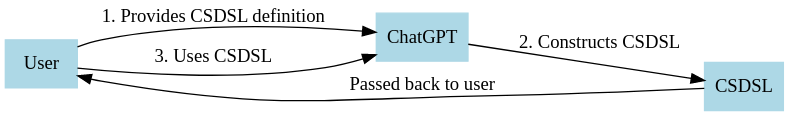

# Implementing Context-Specific Domain Specific Languages (CSDSLs) in Large Language Models

Authors: Benedikt Wimmer - LuftBlick OG, Austria (benedikt.wimmer@luftblick.at, pandonia-global-network.org), ChatGPT (GPT-4)

## Abstract

This white paper presents a comprehensive approach to implementing Context-Specific Domain Specific Languages (CSDSLs) in Large Language Models (LLMs). We propose a framework for developing, integrating, and using CSDSLs to enhance the communication between humans and LLMs, enabling more effective collaboration and problem-solving.

## CSDSL definition<a name="csdsl-definition"></a>

A CSDSL is a language that is optimized for a specific context and domain. It is designed to be used in conjunction with LLMs, thereby enhancing the communication with and effectiveness of these models. CSDSLs are defined by a set of rules that govern their syntax and semantics. These rules are designed to be as expressive as possible, while remaining concise and manageable. The goal is to create a language that is both human-readable and machine-understandable, thereby bridging the gap between human language and machine code.

Here is the definition of CSDSLs, given as an instance of a CSDSL:

```xml
<AI_TRAINING_DEFINITION>
    <DEFINE_CONCEPT NAME="Context-Specific Domain-Specific Languages (CSDSLs)">
        <BRIEF_DEFINITION>CSDSLs are custom languages designed to enhance communication between humans and Large Language Models (LLMs) by improving context sensitivity, precision, and adaptability to specific domains.</BRIEF_DEFINITION>
        <USAGE>
            <STEP DESCRIPTION="Define CSDSLs: This involves providing a CSDSL definition to the LLM, setting up context-specific interactions."/>
            <STEP DESCRIPTION="Construct a CSDSL with LLM: Ask the LLM to create a CSDSL instance that fits your needs."/>
            <STEP DESCRIPTION="Execute the CSDSL: Feed the generated CSDSL back into the LLM to generate desired outputs, ensuring contextually accurate results."/>
        </USAGE>
        <EXAMPLE>
            <CSDSL_EXAMPLE><![CDATA[
                <!-- CSDSL for managing calendar events -->
                <CALENDAR_MANAGEMENT>
                <ADD_EVENT TITLE="Project Meeting" START="2023-04-01T14:00:00" END="2023-04-01T15:00:00" LOCATION="Conference Room"/>
                <DELETE_EVENT TITLE="Weekly Review" DATE="2023-04-03"/>
                <RESCHEDULE_EVENT TITLE="Lunch with John" NEW_START="2023-04-02T13:00:00" NEW_END="2023-04-02T14:00:00"/>
                <GENERATE_API_CALLS LANGUAGE="Python" LIBRARY="google_calendar"/>
                </CALENDAR_MANAGEMENT>
            ]]></CSDSL_EXAMPLE>
        </EXAMPLE>
    </DEFINE_CONCEPT>
</AI_TRAINING_DEFINITION>
```

Users can simply copy this self-contained definition into a LLM chat conversation and start using CSDSLs right away.

## Powerful Examples of CSDSLs in Action<a name="powerful-examples"></a>

1. **Two-Step Software Application Building**: Using CSDSLs, we can streamline the software development process into two main steps. First, the user formulates their top-level goal and either provides an initial CSDSL definition, or asks the LLM to craft one. The LLM then translates the top-level goal into an instance of the agreed-upon CSDSL, which can be an iterative and possibly interactive process. In the second step, the LLM takes the translated instructions with accurately defined context and perfect information density and abstraction level and uses them as input to generate a working program in a specific language.

```xml
        <!-- CSDSL for a simple web application -->
        <WEB_APP>
        <CREATE_COMPONENT TYPE="header" TEXT="Welcome to My Web App"/>
        <CREATE_COMPONENT TYPE="button" TEXT="Click me" ONCLICK="handleClick"/>
        <GENERATE_CODE LANGUAGE="Python"/>
        </WEB_APP>

```

2. **Automated Data Analysis**: In the realm of data analysis, CSDSLs can greatly simplify the process of extracting insights from complex datasets. By first defining a domain-specific language for data analysis tasks, users can communicate their goals more effectively to the LLM. The LLM can then generate a CSDSL instance that captures the user's intent and desired outcome, subsequently generating the required code to perform the data analysis and visualization, all while optimizing the code for performance and readability.

```xml
    <!-- CSDSL for data analysis tasks -->
    <DATA_ANALYSIS DATASET="sales_data.csv">
    <FILTER COLUMN="region" VALUE="North America"/>
    <AGGREGATE FUNCTION="sum" COLUMN="revenue"/>
    <VISUALIZATION TYPE="bar" X_AXIS="product_category" Y_AXIS="revenue"/>
    <GENERATE_CODE LANGUAGE="Python" LIBRARY="pandas,matplotlib"/>
    </DATA_ANALYSIS>

```

3. **Intelligent Virtual Assistants**: CSDSLs can empower virtual assistants to better understand and execute complex tasks for their users. For example, a user could ask their virtual assistant to manage their calendar events and meetings by describing the desired behavior. The LLM would translate the user's request into a CSDSL instance and generate the necessary code or API calls to execute the task as instructed. The virtual assistant would then be able to manage the user's calendar more effectively, tailoring its actions to the user's specific requirements and preferences.

```xml
        <!-- CSDSL for managing calendar events -->
        <CALENDAR_MANAGEMENT>
        <ADD_EVENT TITLE="Project Meeting" START="2023-04-01T14:00:00" END="2023-04-01T15:00:00" LOCATION="Conference Room"/>
        <DELETE_EVENT TITLE="Weekly Review" DATE="2023-04-03"/>
        <RESCHEDULE_EVENT TITLE="Lunch with John" NEW_START="2023-04-02T13:00:00" NEW_END="2023-04-02T14:00:00"/>
        <GENERATE_API_CALLS LANGUAGE="Python" LIBRARY="google_calendar"/>
        </CALENDAR_MANAGEMENT>

```

## Usage with ChatGPT

Using Context-Specific Domain-Specific Languages (CSDSLs) with ChatGPT is a streamlined process that can greatly enhance the communication and collaboration with the language model. Here, we will detail the steps you need to follow to start benefiting from this powerful approach.

1. **Define CSDSLs and Their Usage**: Begin by copying the self-contained [CSDSL definition](##-CSDSL-definition<a-name="csdsl-definition"></a>) into the chat. This step is critical as it sets up the understanding of the language model regarding CSDSLs and their usage. The language model needs this context to interpret your instructions correctly and generate responses that align with the CSDSL syntax and semantics. This initial setup forms the basis for all subsequent interactions using CSDSLs.

2. **Construct a CSDSL with ChatGPT**: Next, you should ask ChatGPT to construct a CSDSL that can be fed back into the chat and will yield your desired output. This step is crucial as it allows you to specify the exact requirements for the language model, thus making the interactions more context-specific. ChatGPT can help you design the appropriate CSDSL based on your goals, taking into account the specific context and desired output format.

3. **Feed the CSDSL Back into ChatGPT**: Finally, copy the outputted CSDSL back into ChatGPT and enjoy the result. This step concludes the process by executing the CSDSL and generating the output. The result will align closely with your expectations, showcasing the power of CSDSLs in making language model outputs more relevant, precise, and useful.



## Example

Let's look at an example of this process with the 'Theory and Development' section of the draft of a future CSDSL paper.

After copying the CSDSL definition, we asked ChatGPT to generate a CSDSL for this section and received this response:

```xml
<PAPER_SECTION output_format="markdown code block">
    <DEFINE_SECTION_TITLE>Theory and Development of CSDSLs</DEFINE_SECTION_TITLE>
    <DEFINE_SECTION_CONTENT>Write a detailed section on the theory and development of CSDSLs. Discuss the theoretical framework behind CSDSLs, explaining how they were developed and their underlying principles. Explain how CSDSLs function to improve communication with LLMs by providing a structured format for interactions, thereby making them more effective and contextually aware. Elaborate on how CSDSLs help to tailor the LLMs to specific needs and domains, and describe the process of defining and implementing CSDSLs.</DEFINE_SECTION_CONTENT>
</PAPER_SECTION>
```

After receiving the CSDSL, we copied it back into the chat and the generated response can be seen [here](theory.md).

And here is the CSDSL which generated this usage section, only some minor human adjustments were made, like inserting a link:

```xml
<PAPER_SECTION output_format="markdown code block">
    <DEFINE_SECTION_TITLE>Usage with ChatGPT</DEFINE_SECTION_TITLE>
    <DEFINE_SECTION_CONTENT>Write a detailed section on how to use CSDSLs with ChatGPT. The section should include the following steps:

1. Copy the content of the full README.md into the chat to define CSDSLs and their usage. Explain why this step is necessary and how it helps to set up the language model for understanding and generating CSDSLs.
2. Instruct the user to ask ChatGPT to construct a CSDSL which can be fed back into the chat and will yield the desired output. Clarify how this step contributes to specifying the exact requirements for the LLM.
3. Describe the step of copying the outputted CSDSL back into ChatGPT and enjoying the result. Highlight the benefits of this approach.

Finally, provide an example of this process using the creation of the 'Theory and Development' section of the paper as an instance. Show the initial request for the CSDSL, the CSDSL produced, and how it was used to generate the section content.</DEFINE_SECTION_CONTENT>
</PAPER_SECTION>
```


## Conclusion<a name="conclusion"></a>

CSDSLs represent a significant advancement in human-LLM communication, enabling more effective collaboration and problem-solving across various domains. By designing dynamic, adaptable, and interoperable CSDSLs, we can unlock the full potential of LLMs and revolutionize the way we interact with these powerful tools.

